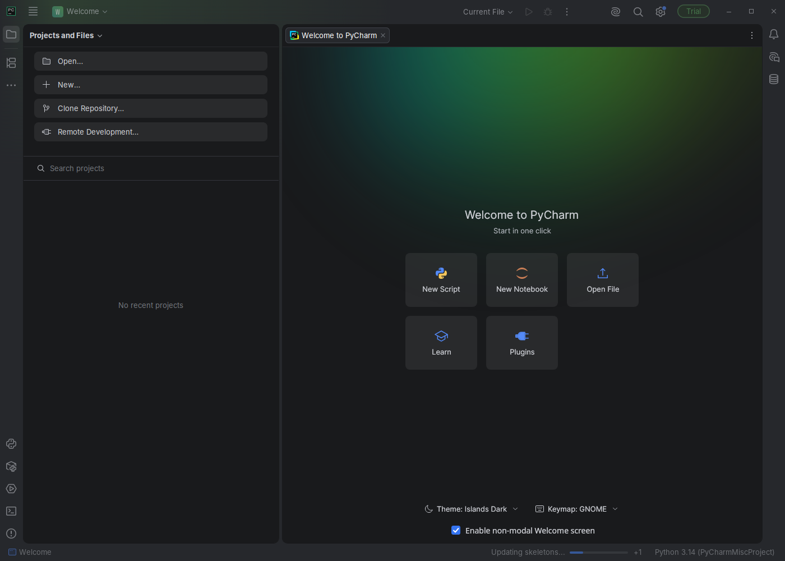
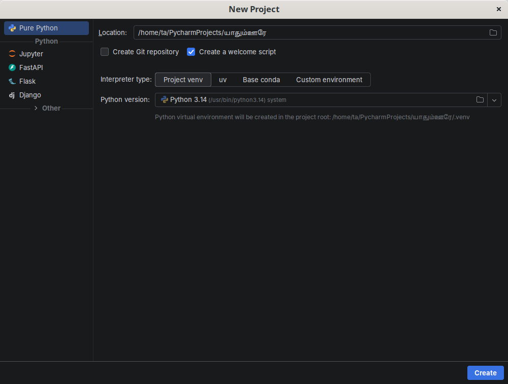
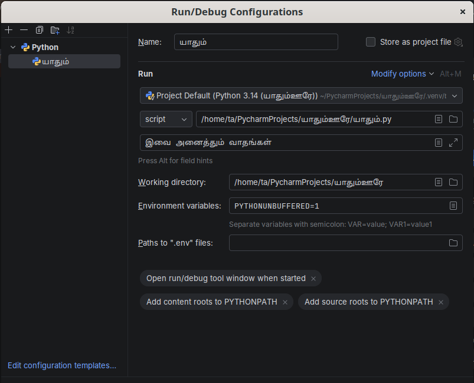
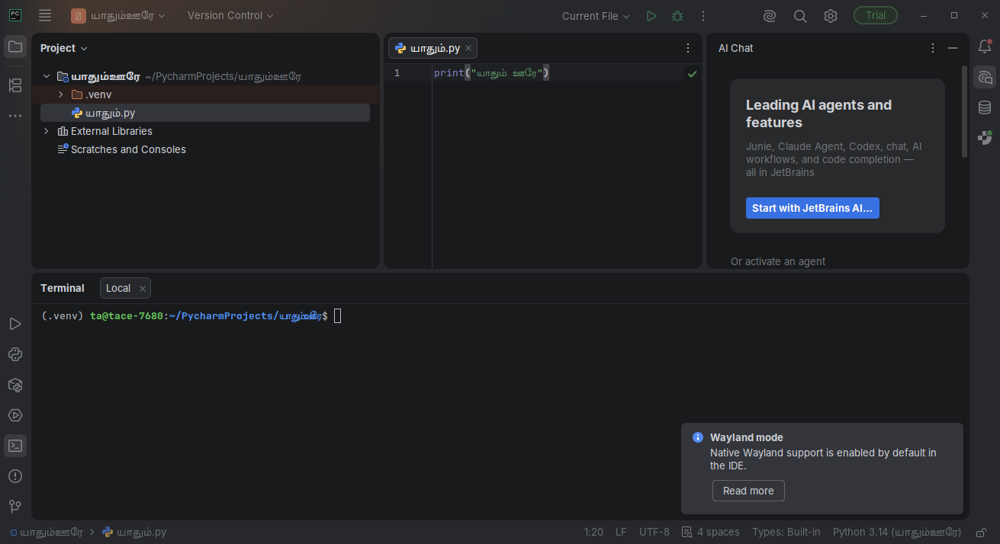
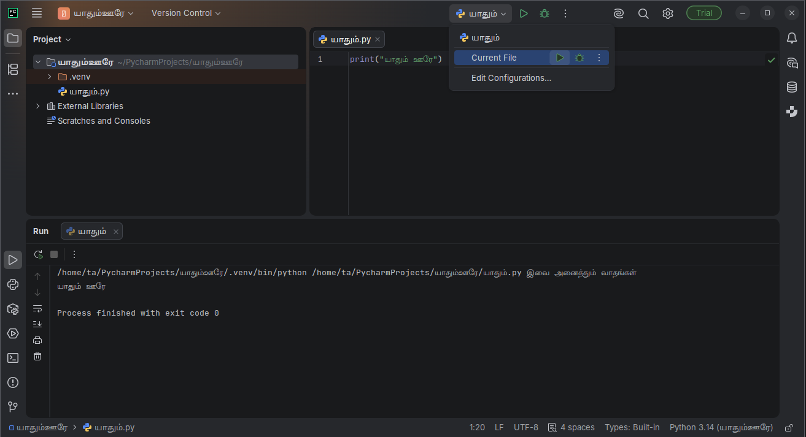
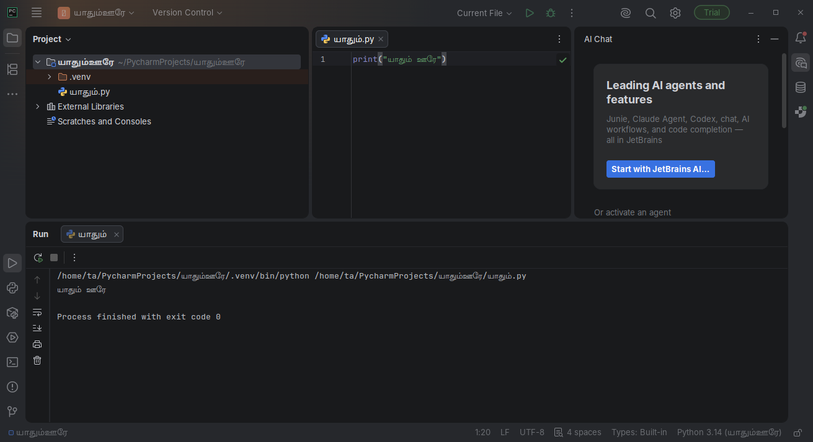
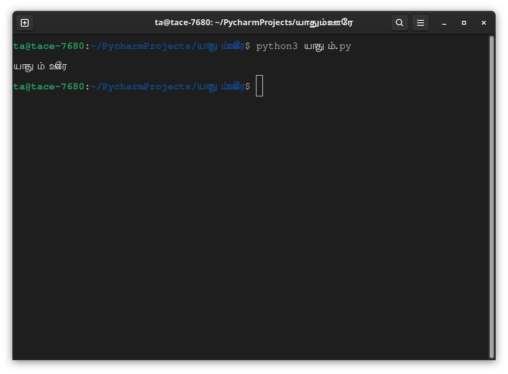

#  

   ' '      .    ,       .

        -         .        .

##   

( [](./..md#)   )      ,  `python3`    `[]`      .

  ,     `>>>`  .  _  _  .

  ,   :

```python
print(" ")
```

  `[]`  .  ` `    .

          .        ,       (, `>>>` )       .

<!--  book.json-      . -->
```python
$ python3
Python 3.6.0 (default, Jan 12 2017, 11:26:36)
[GCC 4.2.1 Compatible Apple LLVM 8.0.0 (clang-800.0.38)] on darwin
Type "help", "copyright", "credits" or "license" for more information.
>>> print(" ")
 
```

       !        __ . `print`     ()    . ,  ` `  ,    .

###     

 /     , `[ + d]`    `exit()`  (:  `()`   ),   `[]`      .

    , `[ + z]`    `[]`  .

##   

            ,    ,       .

    ,        .    ,      . ,     .         .   ,      ,    ,   ()     .

    _ _  . ,      . ,    __ ,    .

     , ,     /   [  ](https://www.jetbrains.com/pycharm-edu/)    .   .

   , **   .    ,     . ,    ,        .     .

    ,   [](http://www.vim.org)  [](http://www.gnu.org/software/emacs/)   .  ,      ,         .        ,  [    ]({{ book. }}) .

        ,       . ,        . ,    ,    ,       .

 ,      -        .

       , [    ](https://realpython.com/courses/finding-perfect-python-code-editor/)  .

##  {#}

[  ](https://www.jetbrains.com/pycharm-edu/)          .

 - , ​​ ,   `Create New Project`:



`New... >> Project Python` :



``   `` ,     :



``  .

``       `` -> ` `  :


``    ,  :


      :



   ,    :

<!--  :  3-  . -->

```python
print(" ")
```
     ( )   , ` ''` .



   ( )   :



!    ,  ,         , `` ​   -> ``-> ` `     ,     .

    [  ](https://www.jetbrains.com/pycharm-educational/quickstart/)  .

## 

1. [](http://www.vim.org)- 
    *     [](http://brew.sh/)    `macvim`  .
    *   [ ](http://www.vim.org/download.php) "   "   .
    * /  -      ,       `vim`  .
2.   [-](https://github.com/davidhalter/jedi-vim)  .
3.   `jedi`   : `pip install -U jedi`

## 

1. [ 24+](http://www.gnu.org/software/emacs/)- .
    *     Emacs- http://emacsformacosx.com     .
    *   http://ftp.gnu.org/gnu/emacs/windows/   Emacs-   .
    * /  Emacs-      ,       `emacs24`  .
2. [](https://github.com/jorgenschaefer/elpy/wiki)- 

##    

   .      ,      ` `       -    ` `      .  [^1]  ,  "    ,      " .

   ,   ,  `.py`  .

 - , [    ](#)     .

 ,     `.py`,   :

```python
print(" ")
```

   ?       .     ,    ,         :

-    `/tmp/`
- / `/tmp/`
-  `C:\`

      ,   `mkdir`  , , `mkdir /tmp/`.

:    `.py`  , , `.py`.

   :

1.     (      [](./..md#)  )
2.       **cd**, , `cd /tmp/`
3.     `python3 .py`.    .

```
$ python3 .py
 
```



    , ! -       .      ,       !

   ,    __   ,   .        ,  `print`  `Print`   -  `p`  ,  `P`    . ,             - [  ](./..md#)   .

**  **

   __  .   ,     .  ,  " "   ,  `print` __ .

##  

          ,  `help`  .        . , `help('len')`  ,        .

:   `q` .

,       .  `help()`       `help`!

`return`      ,         , `help('return')`     . 

## 

     ,    .

    ,     .

---

[^1]:  ' '   
