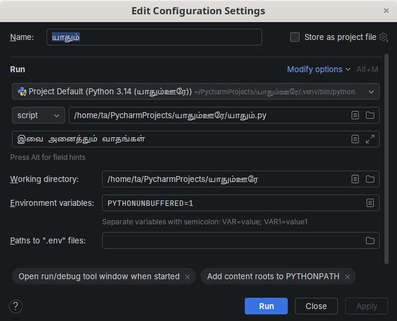

# 

` `    , ?       -    ,       .       ,       .

## 

__   `#`      .      .

:

```python
print(' ') # print     .
```

:

```python
# print     .
print(' ')
```

      :

-  
-   
-   
-     .
-        .

[* ''  ,   ''   .*](http://www.codinghorror.com/blog/2006/12/code-tells-you-how-comments-tell-you-why.html).

  ,         .  ,       !

##  

     `5`,  `1.23`   `'  '`   `"It's a string!"`    .

 __      -     .   `2`   ,   -        __  . ,      .

## 

    -     .

     `2`    .

   (  __ )  `3.23`  `52.3E-4`.  `E`  10-  .  , `52.3E-4`  `52.3 * 10^-4`  .

> **   **
> 
> `long`    .  `int`      .

## 

  __ __ .      .

       ,     .

###  

      ,  `'  '`.

     ,    ,  .

###  

    ,       .    `"What's your name?"`.

###   {#-}

   (`"""`  `'''`)    .           .  :

```python
''' - .   .
  .
"What's your name?," I asked.
",  ."   
'''
```

###   

 ,    ,    .     ,   .            .

> **/++  **
> 
>   `char`    .     ,          .

<!-- -->

> **/  **
> 
>               -     .

###  

       .    `format()`   .

     `_.py`:

```python
 = 60
 = ' '

print('{0}    {1}  .'.format(, ))
print('  {0}  .'.format())
```

:

```
$ python _.py
     60  .
  {0}  .
```

**  **

    ,  , `format`          `format`  .

     , `{0}`  `format`    ``   . ,   `{1}` `format`   ``   .  0-     ,     0-,    1-,  .

        :

```python
 + '    ' + str() + '  .'
```

        . ,       ,  `format`        . ,  `format`  , ​​         ,    .

,     ,    :

```python
 = 60
 = ' '

print('{}    {}  .'.format(, ))
print('  {}  .'.format())
```

      .

  :

```python
 = 60
 = ' '

print('{}    {}  .'.format(=, =))
print('  {}  .'.format(=))
```

      .

 3.6,    "f-"     :

```python
 = 60
 = ' '

print(f'{}    {}  .')  #    'f'  
print(f'  {}  .')  #    'f'  
```

      .

 `format`     ,       .     :

```python
# '.333'     3  (.)  
print('{0:.3f}'.format(1.0/3))
#    (_) 
# (^) 13   '______'
print('{0:_^13}'.format(''))
# - '  '
print('{}  {}'.format(='', =''))
```

:

```
0.333
______
  
```

   , `print`     " "  (`\n`)    ,      `print`     .      ,     `end`  :

```python
print('', end='')
print('', end='')
```

:

```

```

    `end` :

```python
print('', end=' ')
print('', end=' ')
print('')
```

:

```
  
```

###  

    (`'` )        ,     ? ,   .   `"What's your name?"`.  `'What's your name?'`   ,     ,      . ,           .  _ _    .`'What\'s your name?'`.     `\'`   :   . , ​​   `'What\'s your name?'`  .

     , `"What's your name?"`    . ,    ,           . ,        `\\`.

       ?  , [](#-)              ,    `\n`     .  :

```python
'  \n  '
```

     ,  : `\t` .     ,        .

    ,       ,       ,     . ::

```python
"  . \
  ."
```

 

```python
"  .   ."
```

###  

          ,    `r`  `R`        .  :

```python
r"  \n  ."
```

> **   **
> 
>       . ,    . ,  `'\\1'`  `r'\1'`  .

## 

      -   ,      .  __  .      ,   , ,      .           .  ,       ,     .

##  

    . __  __     .        :

-   ,    ( ASCII   ASCII   )   (`_`)  .
- _     (  ASCII    ASCII   ),  (`_`)   (0-9)  .
-      . , `myname`  `myName`  __.   `n`  ,   `N`  .
- __   ``, `_2_3` . __   `2`, `  `, `-`  `>12_3`. 

##  

 , _ _       .       ,    .  , [](./..md#)        .

## 

 ,      __   .    . _  _   ,  __  .

> **    **:
> 
> ,       ,     .

       .   ,  .

##    

,        :

### 

1. [](./._.md#) .
2.      ..
3.      .
4.     ..

:  [  ](./..md#)    , `Run`-> `Edit Configurations`  , `Script parameters:`      , ``  :



###  

1.    .
2.      .
3.       .
4.     `python .py`  .

### :     

    :

```python
#  : .py
 = 5
print() 
 =  + 1
print() 

 = '''  - .
  .'''
print()
```

:

```
5
6
  - .
  .
```

**  **

    . ,  (`=`) , `5`   ``    .      ,       ,   ,    ``   `5` . , `print`   ``   ,  ,     .

,  ``  `1`   ,   .   , ​​    `6` .

,     ``  ,   .

> **   **
> 
>       .       /.

##    

   __   . _    _   .  _ _  _ _     .

       : `print(' ')`     ,     ,     . 

,        ,     .

         ,   /    (`;`)      . :

```python
 = 5
print() 
```

 

```python
 = 5;
print() ;
```

 

```python
 = 5; print() ;
```

  

```python
 = 5; print() 
```

, *         *  * * .        . ,          __.

       :      ,        .  _  _  :

```python
 = '  . \
  .'
print()
```

:

```
  .   .
```

 ,

```python
 = \
5
```

 

```python
 = 5
```

 ,         .    ,        ,      .  *  *  .    [](./._.md#)   , ​​   .

## 

   . , *      * .  __   .         (  ),      ;   ,    .

 ,    __    .      **   .        .

      ,    . :

```python
 = 5
#  !      
 print(' ', )
print(',  ', )
```

  , ​​  :

```
  File "whitespace.py", line 3
    print(' ', )
    ^
IndentationError: unexpected indent
```

      .   ,   ,       .   , _      _ (,        ). [ ](./._.md#_). ,        .

> ** **
> 
>    .     .      .         ,        .

<!-- -->

> **   **
> 
>     ,   .   `from __future__ import braces`  .

## 

    ,        .         . 
